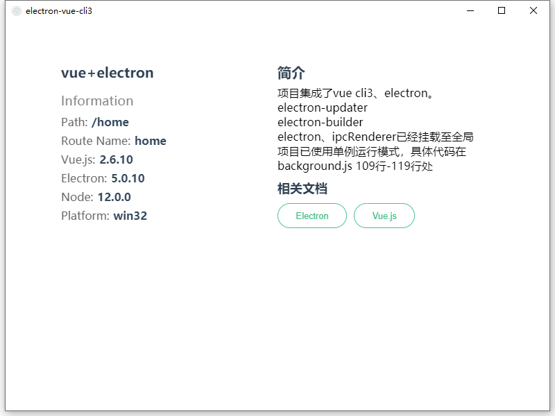

# electron-vue-cli3(electron和vue cli3的基础开发示例)

> electron+cli3+ts

## 个人博客
- [Blog](https://blog.zjinh.cn/)
## 🖥 运行效果
   

### 克隆代码
```bash
git clone https://github.com/zjinh/electron-vue-cli3.git
```

### 安装依赖
```bash
cd electron-vue-cli3
npm i
```
### 淘宝的npm源
```bash
npm config set registry 'https://registry.npm.taobao.org'
npm config set ELECTRON_MIRROR='https://npm.taobao.org/mirrors/electron/'
```
或者使用[Yarn](https://yarnpkg.com/)安装依赖

### 运行项目
```bash
npm run dev
npm run dev:web
```
### 打包项目
```bash
npm run build
npm run build:web
```
